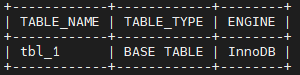
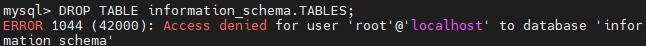
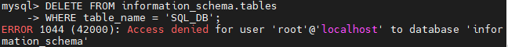
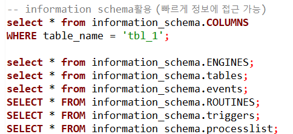
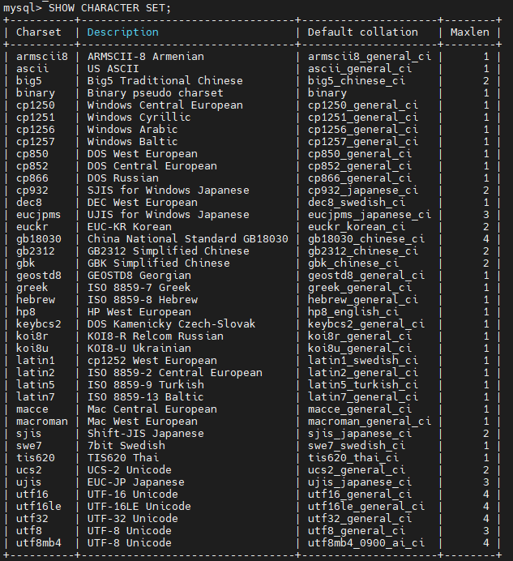
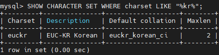
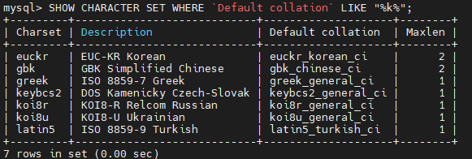
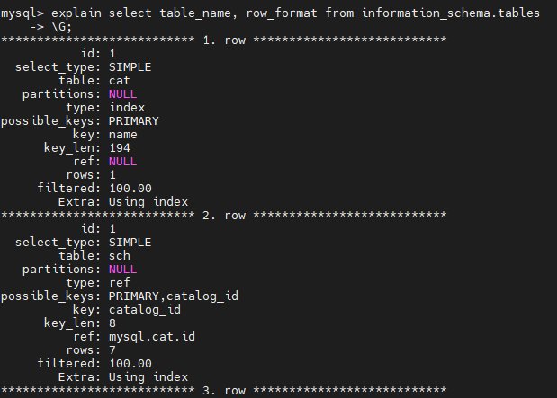
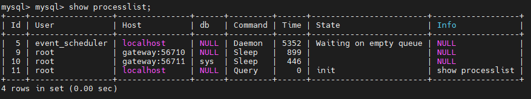
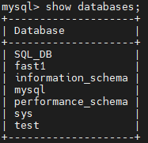

# Metadata 활용(2) - Information Schema

> **Intro**

- Information_Schema는 MySQL 스키마로,
MySQL 서버가 유지 관리하는 모든 데이터 베이스에 대한 정보를 저장한다.
기초 정보와 관련된 중요한 정보가 담겨있다.
실제 이 스키마가 적재되어있는게 아니라, view형태로 되어 있다.
- Infromation_Schema는 **read-only** 로 구성
    - 기본 table이 아니라 실제 view로 관련 파일이 없기 때문에 트리거를 설정할 수 없다.
    - insert, update ,delete, drop과 같은 명령을 수행할 수 없다.
    - innoDB%, Objects, Collations, Events 등의 정보 읽기만 가능

> **실습**

- mysql에 대한 기본 경로로 가기
    - root@ ~ > **cd /var/lib/mysql**
    - DataBase는 기본적으로 폴더 형태로 만들어져있다.
    - information schema는 보이지 않는다. (물리적 데이터 존재 X)
- mysql -uroot -p 로 접속하기
- 실제로 데이터베이스에서는 information_schema가 데이터베이스로 취급을 받지만,
물리적인 데이터는 존재하지 않는다.

    

> **Information Schema 변경 테스트**

- read only이기 때문에 drop, delete 불가능
- select table_name, table_type, engine from information_schema.tables where table_schema='SQL_DB' order by table_name;

    

- drop table information_scema.tables;

    

- DELETE FROM information_schema.tables
WHERE table_name = 'SQL_DB';

    

> **Information_Schema권한**

- 테이블에 대한 엑세스 권한이 있어야만 객체에 해당하는 테이블의 행을 볼 수 있다.

> **Information_Schema 문자 집합**

- 고려사항
    - 기본적으로 CHARACTER SET utf8문자열 형태로 데이터를 저장.
    - column검색은 해당 파일 시스템 대소문자 구분에 영향을 받을 수 있다. (Linux File System)

> **Information_Schema 활용**

- DBeaver에서 test

    

> **Information_Schema 규칙**

- information schema에서 제공되는 정보에 대한 일관된 방법으로 엑세스 유도 목적
- 모든 엑세스가 테이블에서 수행되도록 codd's 의 규칙을 준수
- select 문의 경우 테이블 및 column name을 알아야하지만,
익숙한 구문을 사용해서 이용이 가능하며, 키워드 추가에 대한 걱정 필요 X
- 구문 분석을 위한 데이터 구조나 테스트 표현과 같이 응용프로그램에 필요한 형식으로 filter, sort, concatenate, transform 할 수 있다.
- 다른 DBMS 시스템과 유사하게 운용 가능
- mysql > SHOW CHARACTER SET;

> Information Schema 활용 - Show statements

- show databases;
- show tables;
- show create table;
- show open tables;
- show columns;
- show index; 등등

> Information_Schema 성는 관련 고려사항

- 둘 이상의 DB 정보를 검색하는 쿼리는 오랜 시간이 걸리고 성능에 영향을 줄 수 있다.
- Information Schema의 데이터도 쿼리를 튜닝할 수 있으며, 쿼리의 효율성을 확인하려면, explain을 활용하여 확인이 가능하다.
- explain select table_name, row_format from information_schema.tables;

- from문 혹은 like문을 활용해서 필요한 정보만 검색 할 수 있다.
- show processlist;

    
