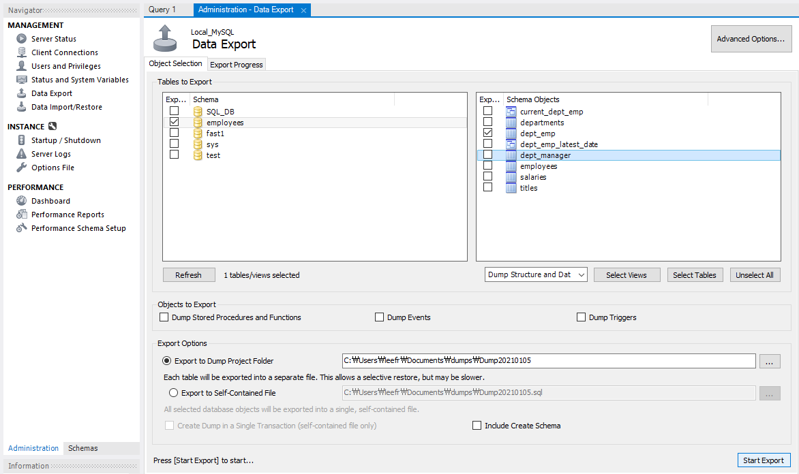
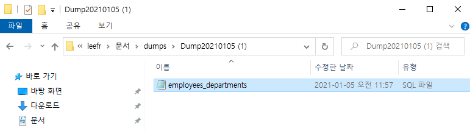
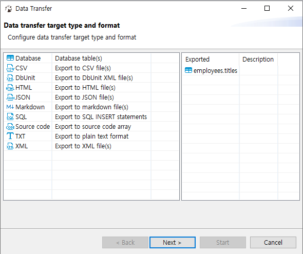
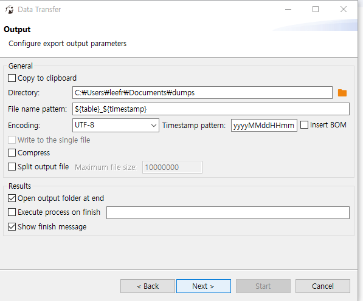
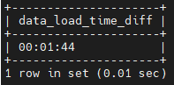

# 일반적인 환경에서의 백업 및 복구

> **개요**

- 데이터 베이스나 테이블 스키마 정보를 SQL문장(텍스트 형식)으로 저장되어 있는 형태.
- 백업 파일의 크기가 데이터베이스의 크기보다 클 수 있다.
- 백업 중에는 반드시 서버가 실행중이어야 한다.
- 로컬, 원격에서 모두 백업이 가능
- 일반적으로는 속도가 느리지만, 휴대하기 쉬움
- 모든 데이터 베이스나 특정 데이터베이스 그리고 특정 테이블 단위로 백업/복구 가능

> **mysqldump 개요**

- 데이터 백업 뿐만 아니라 데이터의 이관, 복제와 같이  
Source Database에서 Target Database로 데이터를 이관하는 경우  
MySQL Package에 기본적으로 내장되어 있는 mysqldump를 기본적으로 사용한다.
- Oracle의 exp, imp와 기능적으로 유사
- 기본 사용 문법

    ```sql
    mysqldump [1.DB 접속 정보][2.Dump옵션][3.Dump 대상옵션] > [Dump받을 파일 경로]
    ```

- mysqldump는 기본적으로 모든 출력물을 화면(stdout)으로 보냄.  
따라서 이 결과를 백업용이나 데이터 이관용으로 사용하기 위해서는 표준 출력파일로  
Redirectoion해서 저장해야함.
- **DB 접속 정보**
    - --host: 데이터베이스 호스트 정보
    - --user: 접속 데이터베이스 계정
    - --password: 접속 데이터베이스 계정의 비번
    - --port: 접속 포트 번호
    - --socket: 접속시 사용할 소켓 파일의 경로
        - 예제
            - `mysqldump --host 127.0.0.1 --user root --password asdf!@#$ --poart 3306 --socket /tmp/mysql.sock`
- 아래와 같이 --help 명령어를 통해 옵션에 대한 설명을 확인할 수 있다.

    ```sql
    [root@DB-web01 ~] #mysqldump --help
    ```

- Dump 사용예제

    ```sql
    -- Test Database의 t1, t2 테이블을 제외하고 dump.sql에 백업
    mysqldump --databases test --ignore-table=test.t1 --ignore-table=db1.t2 - h localhost -u root -p > dump.sql
    -- Test Database의 Create Schema 구문 제외하고 백업
    mysqldump test --no-create-db -h localhost -u root -p > dump.sql
    ```

> **Restore 예제**

- Shell Source 명령어 사용하기
    - `source /path/backup_files.sql`
- redirection사용하기
    - `mysql -u [사용자명] -p [데이터베이스명] < backup_files.sql`
    - `mysql -u root - p SQL_DB < backupDB.sql`

> **다양한 백업 방법들**

- Physical Backup
    - Data Base directory 및 file을 물리적으로 복사
    - 백업 방법이 파일 복사만으로 진행이 되므로, 논리 백업보다 빠름
    - 데이터 베이스 외에도, 로그 또는 구성 파일이 포함되어 있음
    - 백업 도구에는 mysqlbackup 또는 파일 시스템 명령어 cp scp 등이 있다.
    - 주의) 운영중에는 사용 불가.(DB 끄고 백업해야함)
- Replication Backup
    - Master 데이터를 Slave로 복제한 다음 데이터를 백업하는 방법
    - Master에는 영향을 주지 않고, Slave에서 백업 작업을 진행 할 수 있음.
    - Slave는 Master에 비해 지연될 수 있다.
    - Slave가 읽기 전에 Binary Log가 제거되지 않아야한다.

> 실습

- Test Data Restore 해보기([https://dev.mysql.com/doc/employee/en/](https://dev.mysql.com/doc/employee/en/))
    - Shell>
        - git 설치(centOS): `yum install git`
        - `cd /media/`
        - `git clone [https://github.com/datacharmer/test_db](https://github.com/datacharmer/test_db)`
        - `cd /media/test_db` 에서 clone받은 파일들 확인 (`ls -al` 혹은 `ll`)
    - mysql>
        - `source /media/test_db/employees.sql` 로 database restore

            

        - `show databases like 'employees';` 로 Database목록확인
- Test DB Export 해보기
    - Shell>
        - `mysqldump -uroot -p -B employees > /media/exp_emp.dmp`
    - workbanch로 export 받기
        - [Server] - [Data Export]

            

        - export후 결과, local에 export된 것을 확인 할 수 있었음

            

    - DBeaver로 Export 해보기
        - 원하는 테이블 선택 ⇒ Export Data

           

        - CSV로 받아보았음

            

        - 아까 workbench import한 경로랑 같게 설정했음..(찾기 쉬우려구)

            

        - excel 파일로 잘 export됨

           

- Workbench, DBeaver로 import 받는것은 메모 생략