# MySQL Log관리

- **MySQL Log File Intorduce**
    - Error Log: mysqld의 기동, 실행, 정지 등의 문제 기록
    - General Query Log: Client 연결 및 Client로 부터 상태 수신
    [접속에 대한 모든 기록이 남기 때문에, 기본적으로 켜두지는 않음 볼륨 커져서]
    - Slow Query Log : Long_query_time 옵션으로 설정된 값 이상의 Query
    [초 단위로 설정이 되어있는데, 설정 된 값 이상의 sql 이 들어오면 쌓임 , 성능 issue나 sql를 수집하고 싶을 때 활용]
    - Binary Log: 데이터 변경에 대한 모든 상태 값
    - Relay Log: Replication Master 에서 수신된, 데이터 변경에 대한 모든 상태 값.
    - ~~DDL Log(metadata log) : DDL 문에 의해 수행된 메타데이터 작업~~
    - ~~Enterprise Audit: 연결 정보 혹은 쿼리 등 다양한 사용자의 행위 등을 감시~~
    - [레퍼런스](https://dev.mysql.com/doc/refman/5.7/en/server-logs.html)

- **Log File Usage Matrix**

    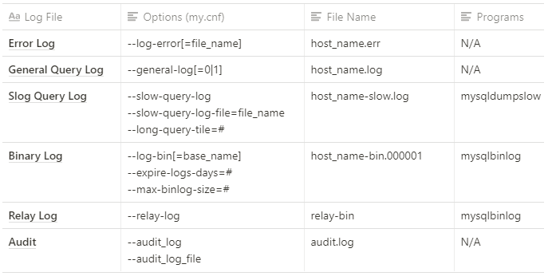

    - Error Log
        - my.cnf에서 --log-error옵션으로 파일이름을 적어주면 사용가능.
        - 파일이름은 기본적으로 host_name.err
        - 별도의 프로그램은 필요 X
    - General Query Log
        - 옵션 0은 사용하진 않음, 1은 사용하는 의미 (my.cnf에 설정)
        - 파일이름은 host_name.log로 만들어짐
    - Binary Log
        - expire-log: 용량이 계속 쌓이지 않도록 보관 기간을 정할 수 있음
        - max-binlog-size: bin log파일이 계속 쌓이면 용량 차지 하는 것을 조정하도록 사용

- **Binary Log 파일 활용하기**
    - List Binary Log Files
        - SHOW BINARY LOGS;

            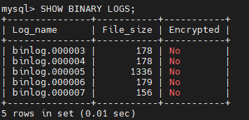

        - SHOW MASTER STATUS;

            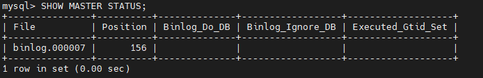

        - 옵션 \G를 마지막에 붙여주면 세로로 볼 수 있음

             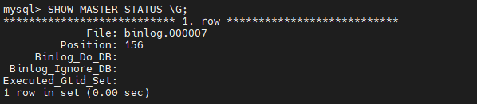

- **View Binary Log**
    - Binary Log는 압축형식으로 저장되므로, 텍스트로 바로 볼 수 없음
    - mysqlbinlog를 통해서 압축형태의 Binary Log를 텍스트 형식으로 변환 후, 내용확인 가능 (표준 출력 형태로 데이터 확인, > 로 표준 출력 스트림을 log.sql로)
        - 실습
            - mysql에 접속해서 
            create database SQL_DB; 로 SQL_DB를 생성하고
            use SQL_DB; 로 사용 DB 설정후
            create table tbl_1 (id integer, memo varchar(1000)); 으로 테이블 생성함
            - show databases; ⇒ 데이터 베이스 확인
            - show tables; ⇒ 데이터베이스 내부에 있는 테이블 확인
            - 실제 mysql 이 저장된 위치는 /var/lib/mysql 하위

                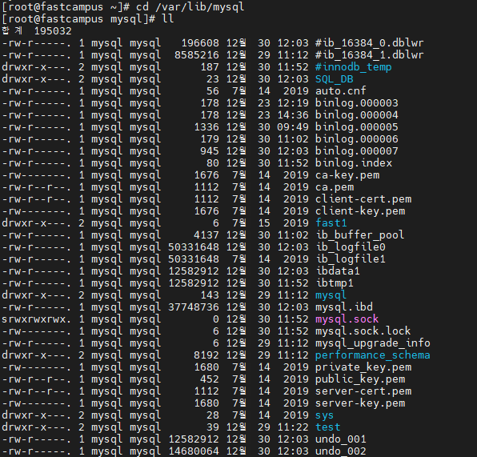
            - mysqlbinlog binlog.000007 > sql_db.sql

               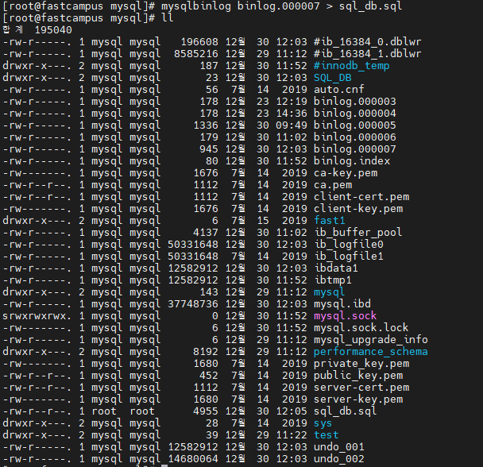

            - vim sql_db.sql (vim편집기로 보기, 하이라이트 된거로 보려고)

                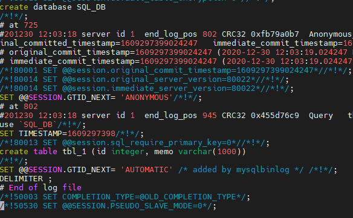

            - binary log에서 작업했던 내용을 전부 확인 가능하다.

    - **Deleteing Binary Logs**
        - 유의사항
            - Binary Log 파일은 설정 및 직접 삭제 말고는 자동 삭제 되지 않는다.
            - Delete logs based on age:
                - mysql > SET GLOBAL expire_logs_days=7;
                days로 설정했더니 초단위로 설정 하라는 error떠서 초단위로 설정함.

                     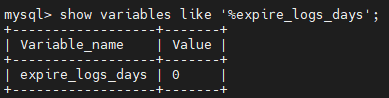

                    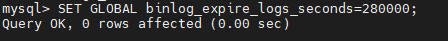

                  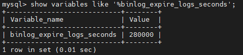

                - mysql > PURGE BINARY LOGS BEFORE now() - INTERVAL 3 day;
            - Delete logs based on file name:
                - mysql > PURGE BINARY LOGS TO 'bin.000001';

- **Slow Query Log 파일 활용하기**
    - Slow Query Log 설정값 확인
        - mysql > show variables like 'slow%';

             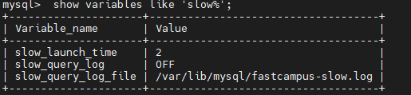

    - slow_query_log 설정하기
        - set global slow_query_log=1;

             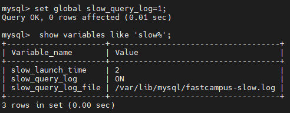

    - slow query flush 수행 (정리)
        - mysql > flush slow logs;
    - 강제로 몇 초간 지연 (slow query 수행)
        - 해당 row당 시간 지연 발생시킴
        - mysql > select * from mysql.user where sleep(2)=0 \G
    - 시스템명령어 (\!) 로 slow query log 확인
        - mysql >\! vi /var/lib/mysql/fastcampus-slow.log

            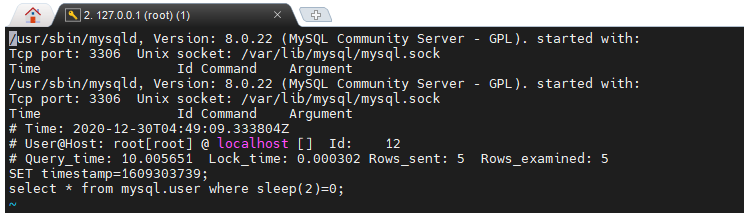
        - 항목 및 설명

             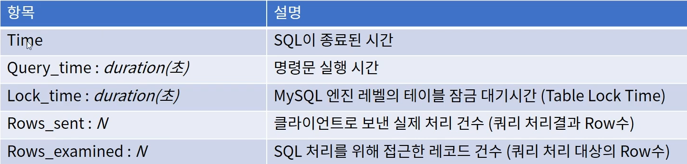
        - DB 성능 issue를 확인하기 가능 (어떤 유저에서 어디서 성능이 낮은지 등등)