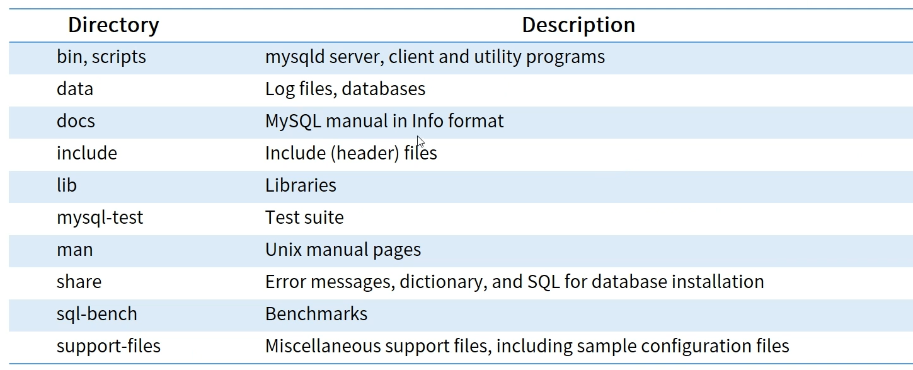
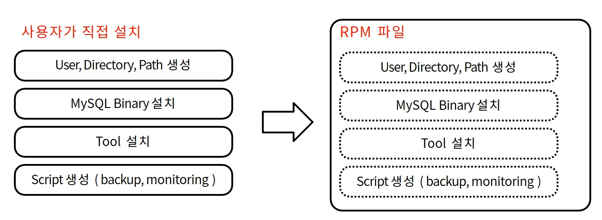
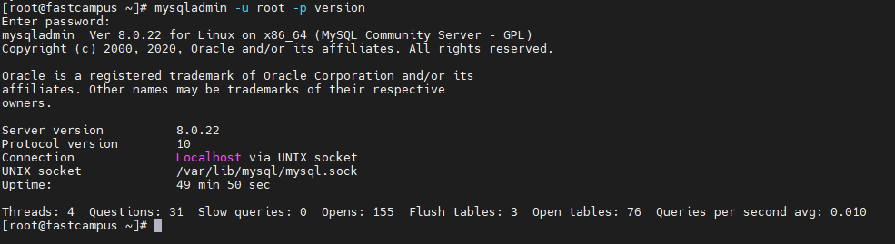

# System Administration

* **My SQL Admin**
  * Linux, Windows, MacOS, Oracle Solaris 등 여러 OS에서 사용가능
  * MySQL은 Binary및 Source 배포판으로 설치 및 사용가능
  * Binary 배포판은 즉시 사용할 수 있도록 Compile 되어 제공
* **MySQL Community Server download**
  * Linux OS환경, RPM을 이용해서 MySQL 설치하기
  * RPM \(Redhat Package Manager\)
    * Red Hat Linux를 비롯한 다른 Linux , Unix 시스템용 공개 패키지 관리 유틸리티
    * rpm명령어를 통해 쉽게 설치 가능
    * 표준화된 내용으로 설치/ 환경 구축 시간 단축

      
* **MySQL Binary 설치 디렉토리 구조**

  

* **RPM 이용한 MySQL 설치 \(5step\)**
  * MySQL Yum Repository Download
    * rpm -ivh [https://dev.mysql.com/get/mysql80-community-release-el7-3.noarch.rpm](https://dev.mysql.com/get/mysql80-community-release-el7-3.noarch.rpm)
  * MySQL Yum Repository 활성화
    * yum repolist all \| grep mysql \| grep enabled
  * MySQL Community Server 설치
    * yum -y install mysql-community-server
  * MySQL Server 구동
    * systemctl start mysqld
  * MySQL 임시 비밀 번호 확인
    * cat /var/log/mysqld.log \| grep -i 'temporary password'
* **Binary를 이용한 MySQL 설치**
  * 필수 Library 설치
    * yum install libaio
  * 계정 생성
    * groupadd mysql
    * useradd -r -g mysql -s /bin/false mysql
  * 설치 파일 압축 해제
    * cd /usr/local
    * tar zxvf /path/to/mysql-VERSION-OS.tar.gz
    * export PATH=$PATH:/usr/local/mysql/bin \#PATH변수 등록
  * 폴더 권한 변경
    * cd mysql
    * mkdir mysql-files
    * chown mysql:mysql mysql-files
    * chmod 750 mysql-files
  * 데이터 베이스 구성
    * scripts/mysql\_install\_db —user=mysql \#MySQL 5.7.6 미만
    * bin/mysqld —initialize —user=mysql   \#MySQL 5.7.6 이상
  * mysql.server 파일 복사
    * cp support-files/mysql.server /etc/init.d/mysql.server
  * MySQL server 구동
    * /etc/init.d/mysql.server start
  * MySQL임시 비밀번호 확인
    * cat /var/log/mysqld.log \| grep -i 'temporary password'
* **MySQL 초기 보안 구성**
  * 계정 접속
    * mysql -u root -p
    * password 입력 \(root password\)
    * show databases; 입력시 error
    * ALTER USER 'root'@'localhost' IDENTIFED BY 'new\_password'; 

      로 계정 패스워드 변경 \(임시 패스워드로는 아무런 작업을 할 수 없기때문\)

      new\_password 도 정책에 맞게 작성.

    * show databases; 입력시 success
* **MySQL 서버 테스트**
  * mysqladmin을 사용하여 서버 실행중인지 확인
    * mysqladmin -u root -p version

      
  * mySQL 환경 변수 확인
    * mysqladmin -u root -p variables
  * mysqladmin 옵션출력
    * mysqladmin -u root -p --help
  * mysql 구동 유무 확인
    * systemclt status mysqld \# mysql 구동되고 있는지 확인
    * ps -ef \| grep mysql         \# mysql 관련된 proccess 확인
  * mysql 서버 기동
    * systemctl start mysqld
  * mysql 서버 중지
    * systemctl stop mysqld
  * 서버 자동 구동 설정
    * systemctl enable mysqld
  * 서버 자동 구동 해제
    * systemctl disable mysqld
  * [레퍼런스](https://dev.mysql.com/doc/refman/8.0/en/mysqladmin.html)

