# Metadata 활용\(1\) - SYS Schema

* **Metadata**: 데이터 베이스를 관리하거나 운영할 때 기본적인 정보, 데이터 사전 

  \(DB와 관련된 정보가 요약되어 저장되어 있는 곳\)

> **SYS Schema**

* DBA, Developer, Ops를 위한 views, procedures, functions 제공
* 일반적인 DBA, Developer의 Debugging, Tunning작업에 필요한 기능을 제공
* MySQL 5.7.7부터 New Featrue로 소개되어 Default 로 포함되고 5.7.7 미만 5.6이상에서는 따로 설치 가능
* 왜 SYS Schema?
  * Performance\_schema를 통해 원하는 데이터를 추출하기가 쉽지 않다.
  * Performance\_schema의 대량 데이터는 여러방면으로 유용하게 쓰일 수 있는데 

    목적에 따라 쉽게 사용할 수 있도록 views, procedures, functions를 제공한다.

> **SYS Schema 설치 \[MySQL 5.6~5.7.7미만일 경우\]**

Shell &gt; git clone [https://github.com/MarkLeith/mysql-sys.git/tmp/sys](https://github.com/MarkLeith/mysql-sys.git/tmp/sys)

Shell &gt; cd /tmp/sys

Shell &gt; mysql -uroot -p --socket=/temp/mysql56.sock&lt;sys\_56.sql

> **SYS Schema 설치 확인**

* select \* from sys.version;

  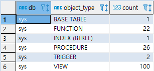

* select \* from sys.schema\_object\_overview where db='sys';

  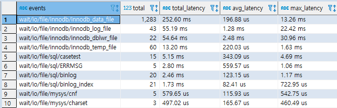

> **SYS Schema Views**

* DB 운영시 참조할만한 view들이 들어있음.
* sys스키마의 뷰를 사용해서 커스터마이징한 뷰를 생성해서 사용 가능
* 모두 performance\_schema와 information\_schema를 기반으로 한다.
* formatted view 와 raw view를 제공 한다.
  * formatted view: 식별하기 쉬운 데이터로 되어있다.  
    SELECT \* FROM sys.waits\_global\_by\_latency LIMIT 10;

    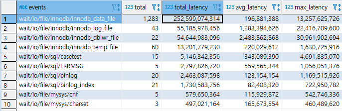

  * raw view: x$로 시작한다. \(tool용\)  
    SELECT \* FROM x$waits\_global\_by\_latency LIMIT 10;

    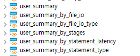

  * 시간데이터의 경우 raw view는 pico second로 되어있고, formatted view에서는 ms, ㎲ 로 보여 준다.

> **SYS Schema Views**

* **User/ Host Summary views \(사용자 요약\)**
  * user_summary_%, host_summary_%: user/host 정보를 보여주는 뷰
  * Breakdown by : IO usage, Stages, Statement details
  * user\_summary: user가 실행한 statement개수, latency, table\_scans, file\_ios, file\_io\_latency등
  * user_summary\_by_%: breakdown 조건에 따른 뷰들

    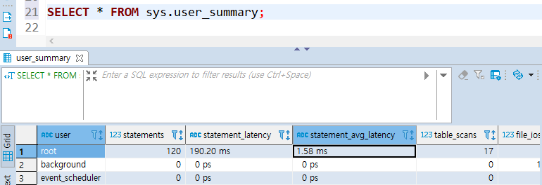

    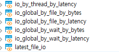
* **IO Summary views \(입출력\)**
  * io\_by\_thread\_by\_latency: current threads 의 IO정보

    Thread별 IO latency 정보, foreground process\(processlist\_id가 있는 것\)분 아니라, background thread에 대한 정보도 포함

  * io_global\_by_%: file별 클래스별 Global 요약정보
  * latest\_file\_io: 마지막 file IO events에 대한 정보

    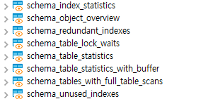
* **Schema Analysis views \(스키마 분석\)**
  * schema\_object\_overview: Object overview
  * schema_table_%: Table 사용 통계 정보

    schema\_tables\_with\_full\_table\_scans: full table scan한 테이블들을 확인할 수 있다.

    스키마 변경, 인덱스 추가를 고려하는 경우에 참고 할 수 있다.

  * schema\_index\_statistics, schema\_unused\_indexed: 

    index 사용통계 정보

    * schema\_unused\_indexeds: drop index등의 스키마 변경을 고려하는 경우 unused indexes 정보 확인 가능

  * 반드시 application 특성에 따라 인덱스 사용빈도 확인 후, 충분히 모니터링 하고 작업할것

    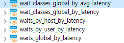
* **Wait Analysis views\(대기, 지연 관련\)**
  * wati_classes_% : event class별 wait summaries
  * wait details per: user, host, globally

    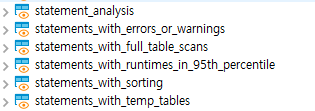
* **Statement Analysis views \(조건에 해당하는 상태\)**
  * statement\_analysis: Statement overview
  * 튜닝 업무 시 참조
  * 조건에 해당하는 Statment를 확인하는 기능

    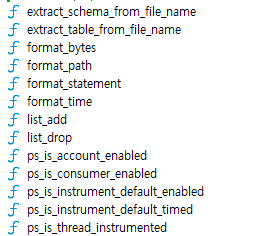
* **Etc views**
  * processlist: show processlist 및 추가 정보 확인할 수 있는 view

    select \* from processlist
* **Functions Views**
  * format\_time: 적절한 time 포맷으로 바꾸는 함수
  * format\_bytes: 적절한 bytes포맷으로 바꾸는 함수
  * format\_path, format\_statement: 식별가능한 포맷으로 변경하는 함수
  * extract\_%\_from\_file\_name: object name 추출
  * ps_is_%: performance\_schema의 측정 도구인지 확인
  * ps\_thread\_id: 해당 connection\_id의 performance\_schema의 thread\_id 변환
  * ps\_thread\_stack: thread stack dump 내리는 함수

    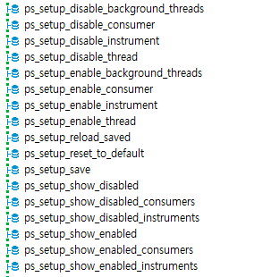
* **Procedures views**
  * Performance Schema 설정 관련\(config help\) procedures
    * ps_setup_%

      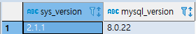
* **Statement Tracing Procedures \(상태 추적\)**
  * ps\_trace\_thread: thread trace를 위해 performance\_schema 데이터 dump
    * 특정 기간 동안 특정 thread 모니터링

      thread activity관련 가능한 많은 정보 캡처

      graph를 그려주는 dot fommatted file을 return
  * ps\_trace\_statement\_digest: statement history table을 확인해서 statement digest 상세정보 캡처
    * 현재 traffic 정보를 분석해서 특정 기간 동안의 statement digest확인
    * 각각의 statement 통계정보를 챕처한 통계정보에 대한 report생성
    * 전반적인 요약분석
    * longest running 쿼리 상세 정보, 실행계획

