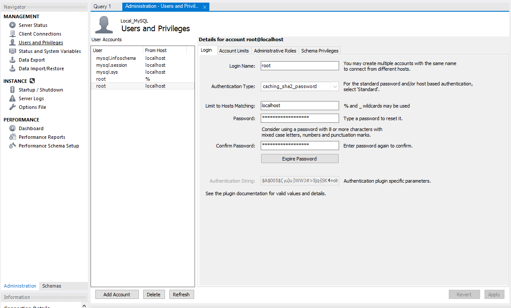

# 간단한 사용자, 테이블관리

> **사용자 관리 개요**

* 사용자 보안을 제어할 수 있다.
* 허가 된 사용자만 작업을 수행할 수 있도록 허용한다.
* 허가 받지 않은 사용자가 자신의 권한 이상으로 엑세스 하는 것을 방지한다.

> **사용자 인증방법**

* MySQL 서버에 접근 시 아래 내용을 통해 접근을 확인
  * Username
  * Password
  * Hostname
* Hostname 형식
  * Name: localhost
  * Hostname: 'hostname.example.com'
  * IP number: 192.168.10.1
  * IP address: 10.0.0.0/255.255.255.0
  * Pattern on wildcard: '%' or '\_'

> **사용자 인증 관리 개요**

* MySQL 계정 정보는 mysql 시스템 데이터 베이스의 테이블에 저장
  * CREATE \[or Alter, Drop, RENAME\] USER Syntax
  * GRANT \[or REVOKE\] USER Syntax
  * SET PASSWORD Syntax

> **사용자 생성 구문**

* 각 계정 CREATE USER에 대해 mysql.user 시스템 테이블에 새 행을 만든다.
* 계정 행은 명령문에 지정된 특성을 반영한다
* 지정되지 않은 속성은 기본값으로 설정
* 처음 생성된 계정에는 권한이 없으므로 권한을 할당하려면 Grant 구문을 사용하여 권한을 부여해야한다.
* 단순 계정 생성
  * `CREATE USER 'test'@'localhost' IDENTIFIED BY 'test_pass'`

> **사용자 변경 구문**

* 영향 받는 각 계정 ALTER USER에 대해 mysql.user 시스템 테이블의 해당 행을  

  명령문에 지정된 등록 정보를 반영하도록 수정한다.

* 지정되지 않은 속성은 현재 값을 유지한다.
* 계정명 지정 형식은 `'user_name'@'host_name'`과  동일한 형식을 사용하며,   

  계정명에서 host\_name부분은 생략시 기본값%으로 설정

* 현재 Session과 연관된 계정을 사용하여 지정하거나 참조 가능  

  `ALTER USER USER() IDENTIFIED BY 'autt_string'`

* 계정 암호를 변경하고 암호를 만료시킨다. 따라서 사용자는 명명된 비밀번호로 연결하고, 다음 연결 시 새 비밀번호를 선택한다.  

  `ALTER USER 'mini'@'localhost' IDENTIFIED BY 'new_password' PASSWORD EXPIRE;`

* 대부분의 옵션은 Create Syntax 사용형태와 구문이 유사하다.

> **사용자 삭제 구문**

* DROP USER문은 하나 또는 그 이상의 MySQL 의 계정과 권한을 제거  

  모든 권한 테이블에서 계정의 권한 행을 제거한다.

* DROP USER 구문을 사용하기 위해서는 전역 Drop User 권한, Create User 권한 또는 mysql System DataBase에 대해 Delete 권한이 있어야 가능하다.
* read\_only 시스템 변수가 활성화 되면, DROP USER 구문은 추가로 Super 권한이 필요
* 존재 하지 않는 사용자를 삭제하고자 할때는 에러가 발생하므로

  `IF EXISTS` 구문을 활용하여 오류보다는 

  존재하지 않는 사용자에 대해 경고를 생성하는 것을 권고한다.

  * `DROP USER if exists test3@localhost`

* DROP USER 는 열려있는 사용자 세션을 자동으로 닫지 않는다.

  오히려 열린 세션이 있는 사용자가 삭제된 경우, 해당 사용자의 세션이 닫힐 때 까지는 명령이 적용되지 않는다.

* 세션이 닫히면 사용자가 삭제 되고, 다음 로그인 시도는 실패한다.

> **사용자 권한 부여, 회수 구문**

* GRANT 문은 MySQL 사용자에게 계정 권한 부여\(↔ Revoke\)
* GRANT 구문을 사용하려면 GRANT OPTION 부여에 대한 권한이 있어야한다.
* read\_only 시스템 변수가 활성화 되려면 GRANT 구문은 SUPER 권한을 필요로 한다.
* GRANT구문과 REVOKE 구문은 상호 보완 되는 구문

  ```sql
    GRANT [GRNAT OPTION] ON [DatabaseName].[Object Name] N [Usuername]@[Hostname]
    GRANT ALL ON db1.* TO 'test'@'localhost';
  ```

> **사용자 이름 변경 구문**

* RENAME USER구문은 MySQL 계정의 이름 변경.  

  기존 계정이 없거나, 이미 존재하는 새 계정에 오류가 발생

* 사용하려면 전역 RENAME USER, CREATE USER 권한이나 mysql 시스템 데이터 베이스에 UPDATE에 대한 권한이 있어야한다.
* read\_only 시스템 변수가 활성화 되면 GRANT 구문은 SUPER 권한을 필요로 한다.

  `RENAME USER 'test'@'localhost' TO 'test2'@'127.0.0.1';`

  계정 이름의 Host name 부분 생략시 기본값 '%'로 설정됨

* RENAME USER 구문은 이전 사용자가 보유한 권한을 새 사용자가 보유한 권한으로 만든다.
* 이전 사용자가 만든 데이터 베이스나 개체를 자동으로 삭제하거나 무효화하지는 않음.

> 계정 정보 확인

`select * from mysql.user \G`

> Workbench에서 사용자 계정 관리하기 \(프로젝트 하면서 사용했던 방법\)



* 사용자 권한, 정보 등의 생성, 삭제, 수정등이 GUI환경이라 편리했다.

